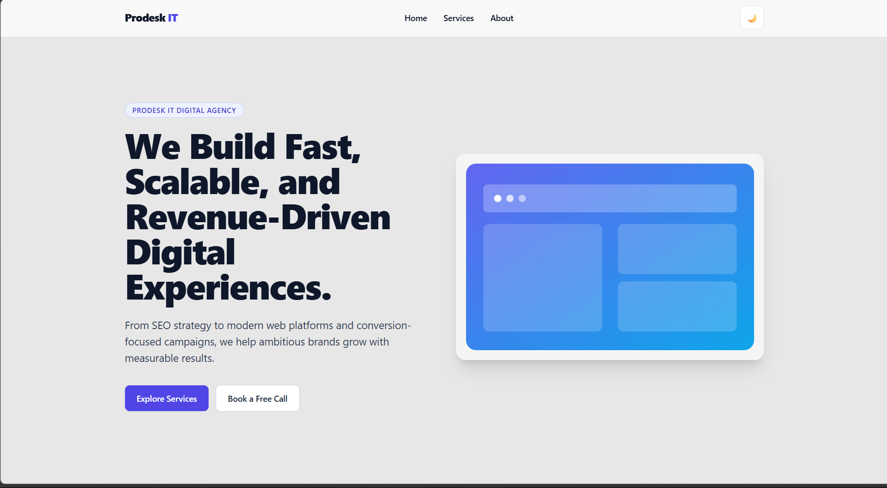
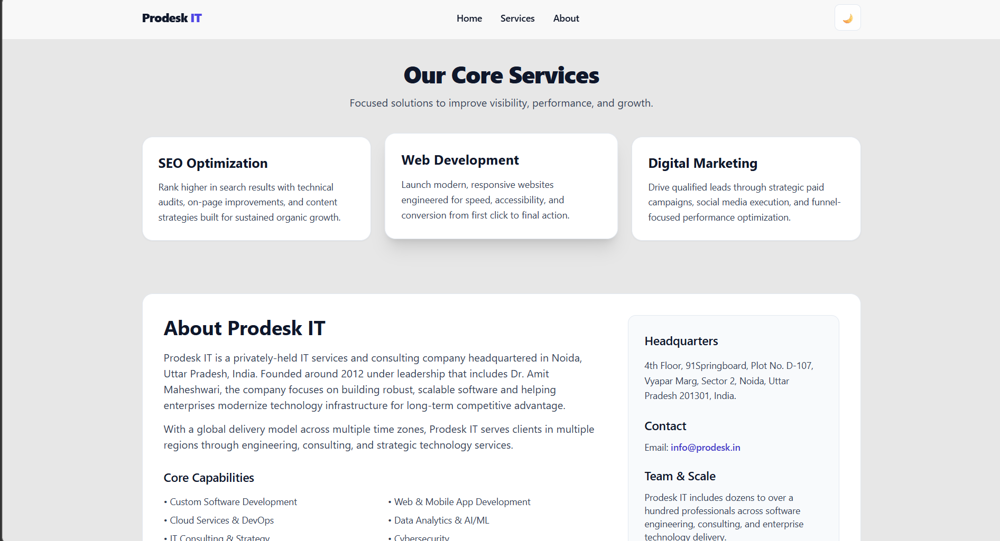

# Prodesk IT Landing Page – Prompt Library


## 1) Full Landing Page Build

```text
Build a responsive landing page for "Prodesk IT Digital Agency" using:

- HTML
- Tailwind CSS (CDN version)
- Vanilla JavaScript

Requirements:
- Sticky navbar with glassmorphism effect (backdrop-blur + bg-opacity).
- Dark mode toggle (use Tailwind dark mode class strategy).
- Responsive hamburger menu.
- Hero section with strong typography.
- Services grid (3 cards).
- Hover animations (scale, shadow).
- Fully responsive mobile-first design.
- Accessibility best practices (aria-labels, alt text, semantic HTML).
- Must be optimized to score 100/100 in Lighthouse Performance and Accessibility.

Provide a single complete HTML file using Tailwind CDN.
```


## 2) Add About Section Prompt

```text
Use this company information to create a proper About section and add an About button in the navbar:

[About Prodesk IT
Prodesk IT is a privately-held IT services and consulting company headquartered in Noida, Uttar Pradesh, India. Founded around 2012 under leadership that includes Dr. Amit Maheshwari, the company focuses on building robust, scalable software and helping enterprises modernize technology infrastructure for long-term competitive advantage.

With a global delivery model across multiple time zones, Prodesk IT serves clients in multiple regions through engineering, consulting, and strategic technology services.

Core Capabilities
• Custom Software Development
• Web & Mobile App Development
• Cloud Services & DevOps
• Data Analytics & AI/ML
• IT Consulting & Strategy
• Cybersecurity
• CRM/HRM Systems
• Digital Transformation
Headquarters
4th Floor, 91Springboard, Plot No. D-107, Vyapar Marg, Sector 2, Noida, Uttar Pradesh 201301, India.

Contact
Email: info@prodesk.in

Team & Scale
Prodesk IT includes dozens to over a hundred professionals across software engineering, consulting, and enterprise technology delivery.]
```


## 3) README Generation Prompt (for future tasks)

```text
Create a README file that includes all main prompts used for this project.
```

---
Screenshots of site 




